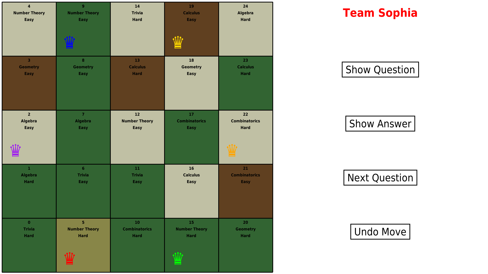
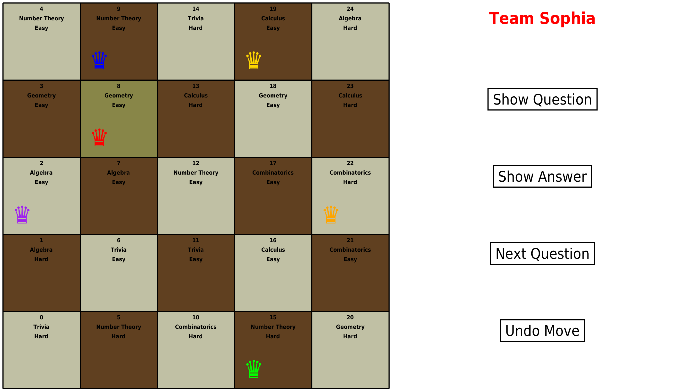
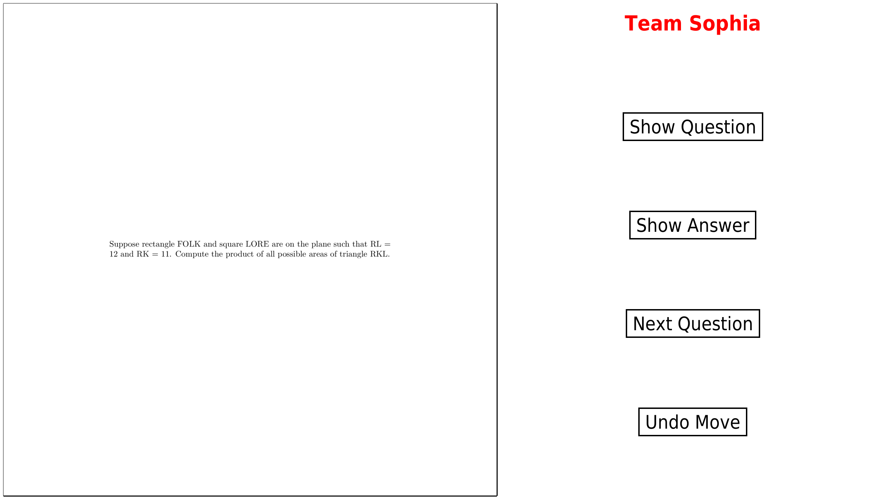
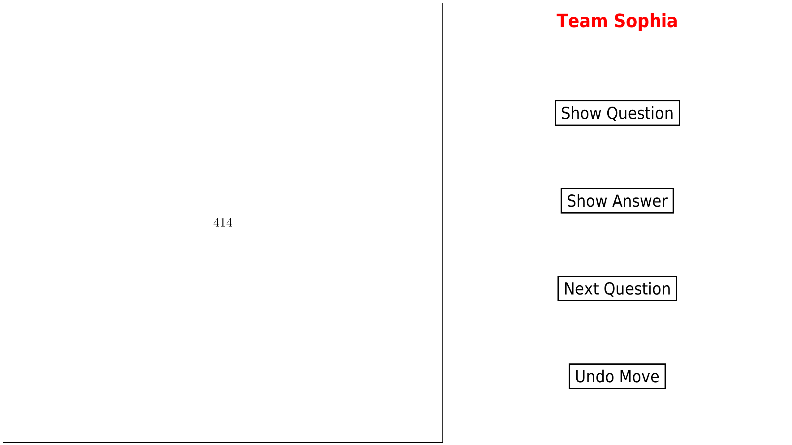
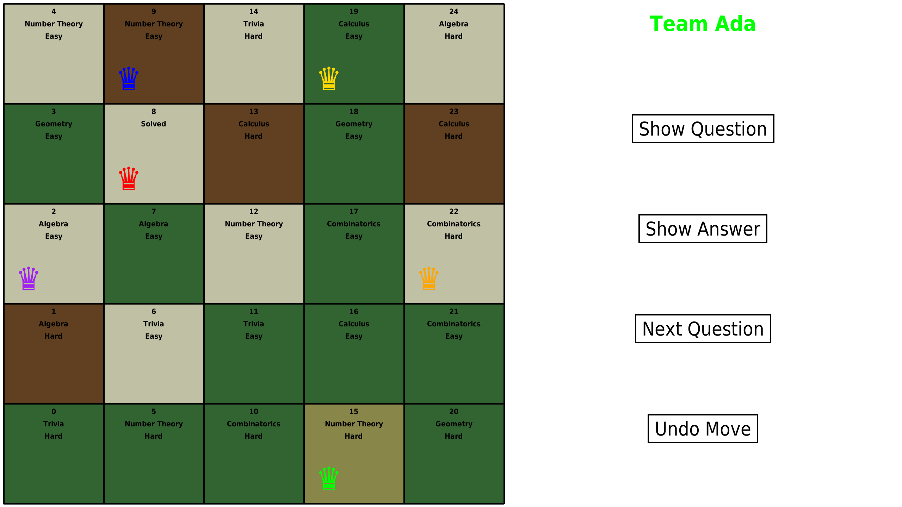

# Chess Adventure Round for Bazinga! Maths
### About
This is a simple game that we created for the Bazinga! Maths event. The game is a simple chessboard with questions on each square. The teams have to answer the questions to get points. The game is written in Python using the Pygame library.
### Rules
- Each team gets a "Queen" piece on a 5x5 chessboard filled with questions (whose topics and difficulties are visible to everyone).
- Teams take turns choosing a new square to move to, and answering the corresponding question.
- If a team does not give the correct answer within the provided time (120 Seconds) they get negative marks (-10), and the question remains open for other teams.
- Question closes when a team answers it correctly (+20 for easy, +40 for hard).
- Teams can choose to move to squares whose question is already solved. In that case, they get zero points and next team gets their turn.
- More than two teams cannot be on the same square.
- Game finishes after each team gets 3 turns, i.e. after three rounds.
### How to run
- Clone the repository
- Install the required libraries using `pip install -r requirements.txt`
- You can change the resolution of the game by changing the `dim` variable in `chess.py`
- Run the game using `python3 chess.py` (or `python chess.py` on Windows)
- **Advanced**: You can change the questions in the `questions.csv` file. To re-render them, run `python3 render_questions.py`. Requires `pdflatex` to be installed.
### Screenshots
<!-- show screenshots images/start.png, images/chosen_move.png, images/display_question.png, images/display_answer.png, and images/next_team.png -->

### Contributors
<!-- Dhananjay Raman (https://github.com/DhanoHacks) is the sole contributor, add link to his id -->
- Dhananjay Raman: [GitHub](https://github.com/DhanoHacks), [Personal Website](https://www.cse.iitb.ac.in/~dhano/)
### License
This project is licensed under the MIT License - see the [LICENSE](LICENSE) file for details.